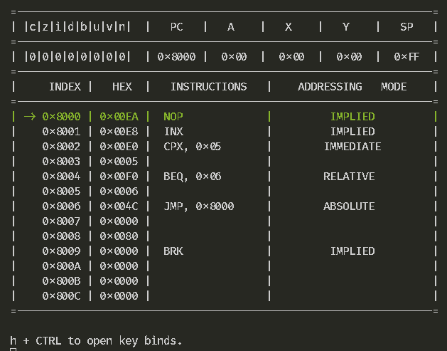

# A 6502 emulator written in C3!  

Decided to follow along with [davepoo's](https://github.com/davepoo/6502Emulator) 6502 emulator [series](https://youtube.com/playlist?list=PLLwK93hM93Z13TRzPx9JqTIn33feefl37&si=EhTCDCjILDLfYWhP) in C3, for fun!  

As a follow up i've been working on a little terminal debugger thing for it? Currently only compiles for Windows, but the actual emulation code should compile just fine regardless...

Debugger:

